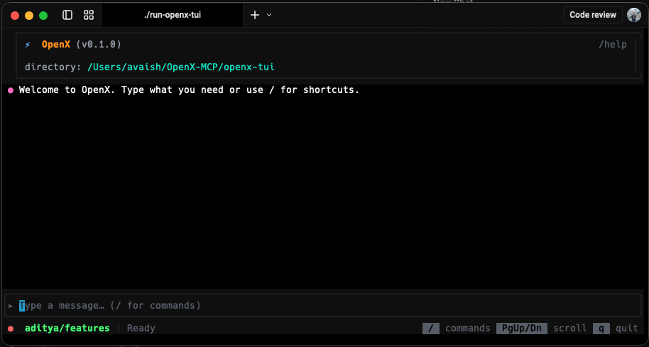
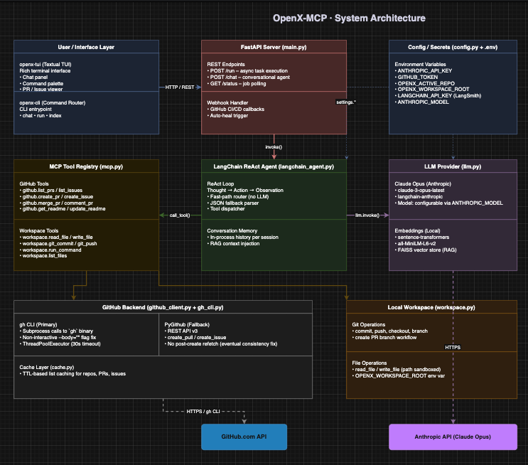

<p align="center">
  <h1 align="center"> OpenX </h1>
  <p align="center">
    <strong>An intelligent MCP (Model Context Protocol) server that automates GitHub workflows, CI/CD pipelines, code analysis, and pull request self-healing.</strong>
  </p>

<p align="center">
  
</p>
<p align="center">
  <em>OpenX Terminal — command palette, slash commands, and real-time MCP communication.</em>
</p>

## Project Overview

**OpenX** is a autonomous Developer agent that connects to GitHub repositories and performs intelligent automation — from listing PRs and managing issues to automatically detecting CI failures, analyzing logs, generating code patches, and self-healing broken builds. It combines a **Python MCP backend** with a **Rust-powered TUI** and a **LangChain ReAct AI agent** for natural language command execution.

### What Makes This Project Stand Out

| Capability | Description |
|-----------|-------------|
| **Autonomous CI/CD Self-Healing** | Detects failing PRs → fetches CI logs → analyzes errors → generates code fix patches → commits to PR branch → re-runs CI pipeline — **fully automated, zero human intervention** |
| **AI-Powered ReAct Agent** | LangChain-based autonomous agent with multi-step reasoning, tool selection, and conversation memory |
| **50+ MCP Tools** | Comprehensive tool registry covering GitHub repos, PRs, issues, workflows, code analysis, README management, and local workspace operations |
| **Hybrid Architecture** | Python backend (MCP server + AI agent) + Rust frontend (high-performance TUI with async event handling) |
| **RAG Pipeline** | Retrieval-Augmented Generation for indexed GitHub repository search and context-aware responses |

---

## Technical Architecture



---

## Tech Stack

### Languages & Frameworks
- **Python 3.14+** — Backend server, AI agent, GitHub integration, static analysis
- **Rust** — High-performance terminal UI with async event loop
- **LangChain** — ReAct agent framework with structured tool calling
- **FastAPI** — RESTful MCP server with JSON-RPC endpoints

### Agentic AI
- **Large Language Models (LLM)** — Anthropic  Claude Opus API
- **ReAct Prompting** — Autonomous multi-step reasoning with tool-use and observation loops
- **Retrieval-Augmented Generation (RAG)** — Indexed repository knowledge base for context-aware AI responses
- **Prompt Engineering** — Compact, optimized system prompts for fast inference and accurate tool selection

### DevOps & Automation
- **GitHub REST API v3** — Full CRUD for repositories, pull requests, issues, workflows, and CI/CD
- **GitHub CLI (`gh`)** — Fast subprocess-based operations with thread pool background execution
- **CI/CD Pipeline Automation** — Workflow triggering, log analysis, failure detection, automated re-runs
- **Autonomous Self-Healing** — End-to-end pipeline: detect failure → analyze logs → generate patch → commit fix → re-run CI

### Software Engineering Practices
- **Concurrent Programming** — Thread pool executors for non-blocking I/O, thread-safe lazy initialization
- **Caching Layer** — TTL-based response caching for API rate limit management
- **Error Handling** — Graceful degradation with gh CLI → PyGithub API fallback chain
- **Modular Architecture** — Clean separation: MCP tools, command routing, AI agent, GitHub client, workspace operations
- **Static Code Analysis** — Bug detection, performance analysis, duplicate code detection, architecture summarization

### Infrastructure
- **MCP (Model Context Protocol)** — Standardized tool registration and invocation protocol
- **httpx** — Async-capable HTTP client with connection pooling
- **PyGithub** — Python GitHub API wrapper with enterprise support
- **Pydantic** — Data validation and serialization for tool schemas
- **LangSmith** — LLM observability and tracing integration

---

## Key Features

### Autonomous CI/CD Self-Healing Pipeline
```
Failing PR detected → CI logs fetched → Error analyzed (regex + pattern matching)
    → Code context located (GitHub Search API) → Fix patch generated (unified diff)
        → Patch committed to PR branch → CI re-run triggered
```
Supports: `ModuleNotFoundError`, `ImportError`, `SyntaxError`, `NameError`, `test failures`, `lint failures`, `npm errors`, and more.

### AI Agent with Natural Language Interface
- Type commands in plain English: *"List failing PRs in my repo and fix them"*
- Multi-step autonomous reasoning with observation-based decision making
- Per-conversation memory (8-turn sliding window)
- Fast-path optimization: known commands bypass the LLM entirely for sub-second response

### Repository Analysis Engine
- **Static Analysis** — Detects bugs, performance issues, security concerns
- **Architecture Summary** — Language breakdown, module depth, LOC statistics
- **AI-Enhanced Insights** — LLM-powered analysis of code patterns and anti-patterns

### Rust Terminal UI
- Built with `ratatui` and `crossterm` for cross-platform terminal rendering
- Command palette (`Ctrl+K`), file search (`Ctrl+P`), activity drawer (`Ctrl+D`)
- Real-time MCP server communication with streaming responses

---

## Quick Start

### Prerequisites
- Python 3.14+, Rust toolchain (for TUI), `gh` CLI (optional, for fast GitHub operations)

### Installation

```bash
git clone https://github.com/vaishcodescape/OpenX-MCP.git
cd OpenX-MCP
python -m venv .venv
source .venv/bin/activate
pip install -e .
```

### Configuration

Create a `.env` file with:

```env
GITHUB_TOKEN=ghp_your_token_here
ANTHROPIC_API_KEY=sk-ant-your_key_here        # Required: powers the Claude agent
ANTHROPIC_MODEL=claude-3-opus-latest           # Optional: defaults to claude-3-opus-latest
```

> **GitHub Token Permissions** (Fine-grained PAT): `Contents: R/W`, `Issues: R/W`, `Pull Requests: R/W`, `Metadata: Read`

### Run

```bash
# Start the MCP server (Python backend)
make openx-agent    # or ./run-openx-agent

# Start the Rust TUI (in another terminal)
make openx-tui      # or ./run-openx-tui
```

If you see `ModuleNotFoundError: No module named 'openx_agent'`, start the server with `./run-openx-agent` or `make openx-agent` (they make the package importable from the repo). Or install the package first: `pip install -e .`

---

## Usage Examples

### Command Line
```bash
openx-cli list_prs owner/repo
openx-cli get_pr owner/repo 42
openx-cli analyze_repo /path/to/repo
openx-cli heal_ci owner/repo          # Auto-heal first failing PR
```

### TUI Slash Commands
| Command | Description |
|---------|-------------|
| `/listrepos` | List repositories for authenticated account |
| `/listprs` | List open pull requests |
| `/getpr` | Get PR details with diff and CI status |
| `/createissue` | Create a new GitHub issue |
| `/commentpr` | Post a comment on a PR |
| `/mergepr` | Merge a PR (merge/squash/rebase) |
| `/analyzerepo` | Run static analysis + architecture summary |
| `gh <command>` | Run any GitHub CLI command in background |

### MCP API
```bash
# List tools
curl -s http://localhost:8000/mcp \
  -d '{"id":1,"method":"tools/list"}'

# Call a tool
curl -s http://localhost:8000/mcp \
  -d '{"id":2,"method":"tools/call","params":{"name":"github.list_open_prs","arguments":{"repo_full_name":"owner/repo"}}}'
```

---

## Project Structure

```
OpenX-MCP/
├── openx-agent/                 # Python MCP backend
│   ├── langchain_agent.py       # LangChain ReAct agent with fast-path optimization
│   ├── mcp.py                   # 50+ MCP tool definitions and registry
│   ├── github_client.py         # GitHub API client (PyGithub + httpx)
│   ├── gh_cli.py                # GitHub CLI subprocess wrapper (thread pool)
│   ├── workspace.py             # Local file/git operations (background execution)
│   ├── command_router.py        # Command parsing and routing
│   ├── rag.py                   # RAG knowledge base (index + search)
│   ├── llm.py                   # LLM provider configuration
│   ├── cache.py                 # TTL-based response caching
│   ├── config.py                # Settings and environment config
│   └── analysis/                # Static analysis + AI analysis engine
│       ├── static_analysis.py
│       ├── ai_analysis.py
│       ├── architecture.py
│       └── format_report.py
├── openx-tui/                   # Rust terminal UI
│   ├── src/
│   │   ├── main.rs
│   │   ├── app.rs               # Application state and event loop
│   │   ├── backend.rs           # MCP server communication
│   │   ├── ui/                  # Terminal rendering components
│   │   └── services/            # Background services
│   ├── Cargo.toml
│   └── Cargo.lock
├── Makefile
├── pyproject.toml
└── requirements.txt
```
---
## Steps for Contribution

1. **Fork the repository** — Click "Fork" on GitHub to create your own copy under your account.

2. **Clone your fork** — Clone the forked repo locally and add the upstream remote:
   ```bash
   git clone https://github.com/YOUR_USERNAME/OpenX-MCP.git
   cd OpenX-MCP
   git remote add upstream https://github.com/vaishcodescape/OpenX-MCP.git
   ```

3. **Create a branch** — Use a short, descriptive branch name (e.g. `fix/ci-timeout`, `feat/workspace-sandbox`):
   ```bash
   git checkout -b your-branch-name
   ```

4. **Make your changes** — Follow existing code style and run tests/linters. For Python: `pip install -e ".[dev]"` (if available) and run tests; for Rust: `cargo test` in `openx-tui/`.

5. **Commit and push** — Use clear commit messages and push to your fork:
   ```bash
   git add .
   git commit -m "Brief description of your change"
   git push origin your-branch-name
   ```

6. **Open a Pull Request** — On GitHub, open a PR from your branch to `vaishcodescape/OpenX-MCP` main. Describe what you changed and why; link any related issues.
---

## License

MIT License — see [LICENSE](LICENSE) for details.

---
 
