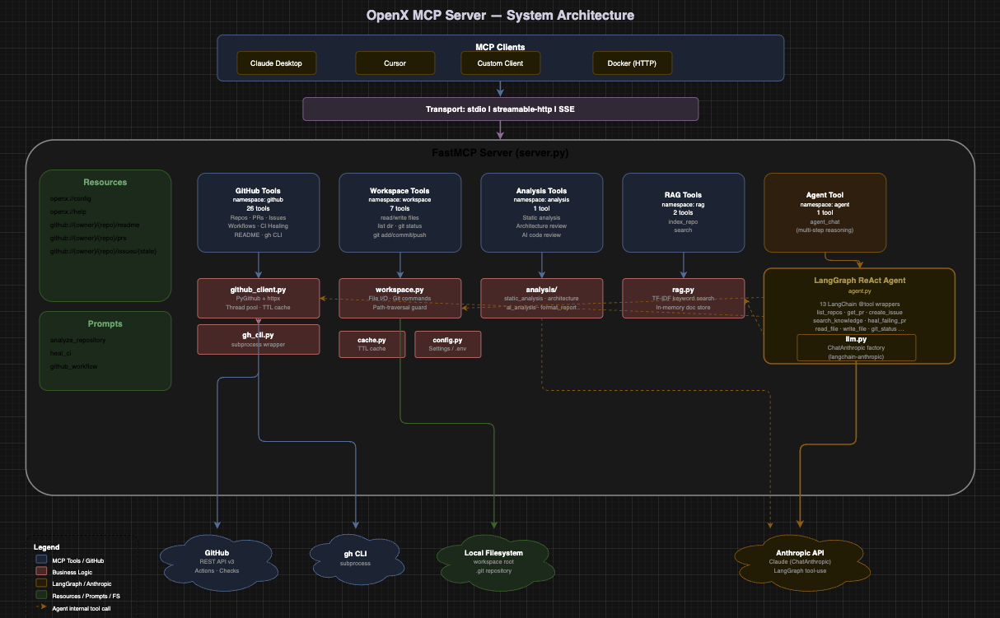

<h1 align="center">OpenX</h1>

<p align="center">
  <strong>AI-powered MCP server for autonomous GitHub automation, CI/CD self-healing, and intelligent code analysis.</strong>
</p>

<p align="center">
  
  
  
  
  
</p>

<p align="center">
  <b>34 tools</b> &middot; <b>5 resources</b> &middot; <b>3 prompts</b>
</p>

<p align="center">
  
</p>

---

## Why OpenX?

OpenX is a production-grade [Model Context Protocol](https://modelcontextprotocol.io) server that turns any MCP client (Claude Desktop, Cursor, or custom) into a full GitHub automation powerhouse. It provides a comprehensive suite of tools for repository management, PRs, issues, and autonomous CI/CD self-healing.

### Autonomous CI/CD Self-Healing

The flagship capability. A single tool call triggers an end-to-end pipeline with zero human intervention:

```
Failing PR detected
  → CI logs fetched & decompressed
    → Error pattern-matched (regex engine: 12+ failure types)
      → Relevant source code located via GitHub Search API
        → Fix patch generated as unified diff
          → Patch committed to PR branch
            → CI re-run triggered
```

> Handles `ModuleNotFoundError`, `ImportError`, `SyntaxError`, `NameError`, test failures, lint failures, npm errors, and more.

---

## What Makes This Stand Out

| Engineering Decision | Why It Matters |
|---|---|
| **Pure MCP architecture** | No REST API wrapper — native `stdio`, `streamable-http`, and `SSE` transports. Plug into any MCP client without glue code |
| **Modular sub-server composition** | 4 namespaced `FastMCP` sub-servers mounted into a root server — clean separation of concerns at the protocol level |
| **Dual GitHub backend** | `gh` CLI (fast subprocess) with automatic fallback to PyGithub API — best of both worlds for speed and reliability |
| **Thread-safe concurrency** | Thread pool executors for non-blocking I/O, double-checked locking for lazy singletons, O(1) LRU-evicting TTL cache |
| **Path-traversal guard** | All workspace file operations validated against the workspace root — agents can't escape the sandbox |
| **Docker-ready** | Multi-stage build with `gh` CLI baked in, non-root user for security, health check endpoint, configurable transport via `CMD` override |

---

## Tech Stack

| Layer | Technologies |
|---|---|
| **Protocol** | FastMCP, Model Context Protocol (stdio / streamable-http / SSE) |
| **GitHub** | PyGithub, GitHub REST API v3, GitHub CLI (`gh`), httpx |
| **Analysis** | Custom static analysis engine, AI-powered code review (Claude) |
| **Infrastructure** | Docker, Pydantic, python-dotenv, thread pool concurrency |

---

## Quick Start

### Install

```bash
git clone https://github.com/vaishcodescape/OpenX-MCP.git
cd OpenX-MCP
pip install -e .
```

### Configure

Create a `.env` file:

```env
GITHUB_TOKEN=ghp_your_token_here
ANTHROPIC_API_KEY=sk-ant-your_key_here
```

> **GitHub Token** (fine-grained PAT): grant `Contents: R/W`, `Issues: R/W`, `Pull Requests: R/W`, `Metadata: Read`.

### Run

```bash
make serve            # stdio transport (Claude Desktop, Cursor)
make serve-http       # HTTP transport on :8000
make docker && make docker-run   # Docker
```

---

## Connect Your MCP Client

<details>
<summary><b>Claude Desktop</b></summary>

Add to `~/Library/Application Support/Claude/claude_desktop_config.json`:

```json
{
  "mcpServers": {
    "openx": {
      "command": "python",
      "args": ["-m", "openx_agent.server"],
      "cwd": "/path/to/OpenX-MCP",
      "env": {
        "PYTHONPATH": "/path/to/OpenX-MCP",
        "GITHUB_TOKEN": "ghp_...",
        "ANTHROPIC_API_KEY": "sk-ant-..."
      }
    }
  }
}
```
</details>

<details>
<summary><b>Cursor</b></summary>

Add to `.cursor/mcp.json` in your workspace:

```json
{
  "mcpServers": {
    "openx": {
      "command": "python",
      "args": ["-m", "openx_agent.server"],
      "cwd": "/path/to/OpenX-MCP",
      "env": {
        "PYTHONPATH": "/path/to/OpenX-MCP",
        "GITHUB_TOKEN": "ghp_...",
        "ANTHROPIC_API_KEY": "sk-ant-..."
      }
    }
  }
}
```
</details>

<details>
<summary><b>Docker (HTTP)</b></summary>

```bash
docker build -t openx-mcp .
docker run --rm -p 8000:8000 --env-file .env openx-mcp
```

For stdio transport:

```bash
docker run --rm -i --env-file .env openx-mcp --stdio
```
</details>

---

## Full Tool Reference

<details>
<summary><b>GitHub</b> — 18 tools</summary>

| Tool | Description |
|---|---|
| `github_list_repos` | List repositories |
| `github_list_prs` | List open pull requests |
| `github_get_pr` | Get PR details with diff and CI status |
| `github_create_pr` | Create a pull request |
| `github_comment_pr` | Comment on a PR |
| `github_merge_pr` | Merge a PR (merge/squash/rebase) |
| `github_get_readme` | Get README content |
| `github_update_readme` | Create or update README |
| `github_list_issues` | List issues |
| `github_get_issue` | Get issue details |
| `github_create_issue` | Create an issue |
| `github_comment_issue` | Comment on an issue |
| `github_close_issue` | Close an issue |
| `github_list_workflows` | List GitHub Actions workflows |
| `github_trigger_workflow` | Trigger a workflow dispatch |
| `github_list_workflow_runs` | List workflow runs |
| `github_get_workflow_run` | Get workflow run details |
| `github_run_gh_command` | Run a raw `gh` CLI command |
</details>

<details>
<summary><b>CI/CD Self-Healing</b> — 8 tools</summary>

| Tool | Description |
|---|---|
| `github_get_failing_prs` | List PRs with failed CI |
| `github_get_ci_logs` | Fetch CI logs for a workflow run |
| `github_analyze_ci_failure` | Analyze CI logs for error patterns |
| `github_locate_code_context` | Find relevant code for an error |
| `github_generate_fix_patch` | Generate a unified diff fix |
| `github_apply_fix_to_pr` | Apply patch to PR branch |
| `github_rerun_ci` | Re-run a CI workflow |
| `github_heal_failing_pr` | Auto-heal a failing PR end-to-end |
</details>

<details>
<summary><b>Workspace</b> — 7 tools</summary>

| Tool | Description |
|---|---|
| `workspace_read_file` | Read a file from the workspace |
| `workspace_write_file` | Write content to a file |
| `workspace_list_dir` | List files and directories |
| `workspace_git_status` | Show git status |
| `workspace_git_add` | Stage files |
| `workspace_git_commit` | Commit staged changes |
| `workspace_git_push` | Push to remote |
</details>

<details>
<summary><b>Analysis</b> — 1 tool</summary>

| Tool | Description |
|---|---|
| `analysis_analyze_repo` | Run full static + AI code analysis |
</details>

<details>
<summary><b>Resources</b> — 5 &nbsp;|&nbsp; <b>Prompts</b> — 3</summary>

| Resource / Prompt | Description |
|---|---|
| `openx://config` | Server configuration (secrets redacted) |
| `openx://help` | Full tool reference |
| `github://{owner}/{repo}/readme` | README content |
| `github://{owner}/{repo}/prs` | Open pull requests |
| `github://{owner}/{repo}/issues/{state}` | Issues (open/closed/all) |
| **Prompt:** `analyze_repository` | Comprehensive code analysis workflow |
| **Prompt:** `heal_ci` | CI/CD self-healing workflow |
| **Prompt:** `github_workflow` | General GitHub automation task |
</details>

---

## Project Structure

```text
openx-agent/                     # Python MCP server package
├── server.py                    # FastMCP entry point — mounts 4 sub-servers
├── github_client.py             # GitHub API — PyGithub + httpx + CI healing pipeline
├── gh_cli.py                    # gh CLI subprocess wrapper (thread pool)
├── workspace.py                 # Sandboxed file I/O and git operations
├── cache.py                     # O(1) LRU-evicting TTL cache
├── config.py                    # Frozen dataclass settings from .env
├── tools/                       # MCP tool definitions (namespaced sub-servers)
│   ├── github.py                #   18 GitHub tools + 8 CI Healing tools
│   ├── workspace_tools.py       #   7 workspace tools
│   └── analysis.py              #   1 analysis tool
└── analysis/                    # Static analysis + AI code review engine
    ├── static_analysis.py       #   Bug/perf/duplication detection
    ├── ai_analysis.py           #   Claude-powered review
    ├── architecture.py          #   Language breakdown, module stats
    └── format_report.py         #   Report formatter
```

---

## Environment Variables

Create a `.env` file in the project root:

```env
# Required
GITHUB_TOKEN=ghp_xxxxxxxxxxxxxxxxxxxx
ANTHROPIC_API_KEY=sk-ant-xxxxxxxxxxxxxxxx

# Optional
ANTHROPIC_MODEL=claude-sonnet-4-20250514
OPENX_ACTIVE_REPO=owner/repo
OPENX_WORKSPACE_ROOT=/path/to/workspace
GITHUB_BASE_URL=https://github.enterprise.api/v3
```
---

## Contributing

1. Fork the repository
2. Create a branch: `git checkout -b feat/your-feature`
3. Make changes and commit: `git commit -m "feat: description"`
4. Push and open a PR against `main`

## License

MIT License — see [LICENSE](LICENSE) for details.
